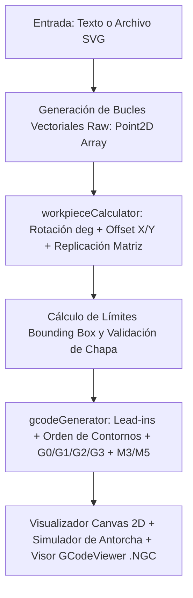

# Manual del Desarrollador — PlasmaNGC Studio

> **Aplicación CAM / CAD Web para Generación de Código G (.NGC) para Corte por Plasma en LinuxCNC / QtPlasmaC**

---

## 📑 Tabla de Contenido
1. [Visión General del Proyecto](#1-visión-general-del-proyecto)
2. [Estructura del Proyecto y Archivos](#2-estructura-del-proyecto-y-archivos)
3. [Flujo de Datos y Pipeline CAM](#3-flujo-de-datos-y-pipeline-cam)
4. [Explicación Bloque por Bloque del Código](#4-explicación-bloque-por-bloque-del-código)
   - [A. Tipos e Interfaces (`src/types.ts`)](#a-tipos-e-interfaces-srctypests)
   - [B. Núcleo Matemático y Chapa (`src/utils/workpieceCalculator.ts`)](#b-núcleo-matemático-y-chapa-srcutilsworkpiececalculatorts)
   - [C. Motor de Generación G-Code (`src/utils/gcodeGenerator.ts`)](#c-motor-de-generación-g-code-srcutilsgcodegeneratorts)
   - [D. Procesador y Parser Vectorial SVG (`src/utils/svgParser.ts`)](#d-procesador-y-parser-vectorial-svg-srcutilssvgparserts)
   - [E. Fuentes Stencil Monolínea para Plasma (`src/utils/plasmaFonts.ts`)](#e-fuentes-stencil-monolínea-para-plasma-srcutilsplasmafontsts)
   - [F. Visualizador Gráfico Interactivo en Canvas 2D (`src/components/CanvasVisualizer.tsx`)](#f-visualizador-gráfico-interactivo-en-canvas-2d-srccomponentscanvasvisualizertsx)
   - [G. Barra de Control de Pizarra y Matriz (`src/components/WorkpieceBar.tsx`)](#g-barra-de-control-de-pizarra-y-matriz-srccomponentsworkpiecebartsx)
   - [H. Conversor SVG con Seguridad de Mesa (`src/components/SvgConverterPanel.tsx`)](#h-conversor-svg-con-seguridad-de-mesa-srccomponentssvgconverterpaneltsx)
   - [I. Visor y Descarga de Código G (`src/components/GCodeViewer.tsx`)](#i-visor-y-descarga-de-código-g-srccomponentsgcodeviewertsx)
5. [Especificaciones para LinuxCNC y QtPlasmaC](#5-especificaciones-para-linuxcnc-y-qtplasmac)
6. [Cómo Realizar Modificaciones Típicas](#6-cómo-realizar-modificaciones-típicas)
7. [Comandos de Construcción y Verificación](#7-comandos-de-construcción-y-verificación)
8. [Guía de Instalación en Taller: Navegador (PWA) vs Ejecutable Local](#8-guía-de-instalación-en-taller-navegador-pwa-vs-ejecutable-local)

---

## 1. Visión General del Proyecto

**PlasmaNGC Studio** es una aplicación cliente (SPA React 19 + TypeScript + Tailwind CSS) que opera completamente en el navegador (offline/PWA). Su propósito es convertir **texto tipográfico** o **archivos vectoriales SVG** en trayectorias de corte optimizadas en código **G-Code estándar RS274/NGC** listo para cargar en máquinas CNC controladas por **LinuxCNC** (interfaz *QtPlasmaC*, *Axis* o *Gmoccapy*).

### Características Fundamentales
- **Cálculo de Lead-in / Lead-out**: Entradas y salidas angulares o tangenciales para que el perforado inicial (*pierce*) se realice en el material de descarte.
- **Fuentes Stencil Monolínea y con Puentes**: Evita la pérdida del centro en letras como A, B, D, O, P, Q, R.
- **Protección de Mesa (Bounding Box)**: Verificación en tiempo real de que el corte no exceda los límites físicos de la chapa o mesa.
- **Rotación en Cualquier Ángulo**: Rotación matemática de puntos y soporte opcional para coordenadas giradas mediante `G10 L2 P1 R...`.
- **Aprovechamiento de Material (Nesting / Desplazamiento)**: Desplazamiento manual en $X$ e $Y$ y replicación en matriz (filas y columnas) con separación configurable (*gap*).
- **Modo QtPlasmaC Nativo (Modo 0)**: Salida limpia sin ejes Z en el archivo, delegando el palpado de chapa (IHS) y el control de altura por voltaje de arco (THC) al hardware de LinuxCNC.

---

## 2. Estructura del Proyecto y Archivos

```text
├── src/
│   ├── types.ts                      # Definiciones de modelos de datos (interfaces TypeScript)
│   ├── App.tsx                       # Componente raíz orquestador del estado y UI
│   ├── main.tsx                      # Punto de entrada de React
│   ├── index.css                     # Estilos globales Tailwind CSS
│   ├── components/
│   │   ├── CanvasVisualizer.tsx      # Lienzo HTML5 Canvas con zoom, pan y simulación en tiempo real
│   │   ├── WorkpieceBar.tsx          # Controles de chapa, presets, ángulo, desplazador X/Y y matriz
│   │   ├── SvgConverterPanel.tsx     # Carga de SVG, drag-and-drop, validación de mesa y auto-ajuste
│   │   ├── TextInputPanel.tsx        # Entrada de texto, tipografía stencil, tamaño y espaciado
│   │   ├── PlasmaSettingsPanel.tsx   # Parámetros de corte: avance, perforación, retardos, M3/M5
│   │   ├── GCodeViewer.tsx           # Resaltado de sintaxis G-Code, estadísticas y descarga (.NGC)
│   │   ├── TableAlignmentModal.tsx   # Guía de taller sobre cómo ubicarse en la mesa física y Touch-Off
│   │   ├── DesktopInstallModal.tsx   # Instalador PWA para taller sin conexión
│   │   ├── OfflineIndicator.tsx      # Indicador de estado de conexión
│   │   └── ErrorBoundary.tsx         # Protección contra errores de renderizado
│   └── utils/
│       ├── workpieceCalculator.ts    # Transformaciones geométricas: escala, rotación, offset y matriz
│       ├── gcodeGenerator.ts         # Generador del texto G-Code según perfiles LinuxCNC/QtPlasmaC
│       ├── svgParser.ts              # Parser de caminos SVG ("d" paths, polígonos, círculos, etc.)
│       ├── plasmaFonts.ts            # Glifos vectoriales monocamino y stencil
│       └── sampleSvgs.ts             # Figuras y piezas mecánicas precargadas
```

---

## 3. Flujo de Datos y Pipeline CAM

El proceso que sigue un texto o un SVG hasta convertirse en archivo `.ngc` se divide en 5 etapas secuenciales:



1. **Entrada**: El usuario escribe texto (usando `plasmaFonts.ts`) o carga un archivo vectorial (usando `svgParser.ts`). Ambos entregan una lista de contornos vectoriales sin transformar (`rawLoops`).
2. **Transformación (`transformLoops`)**: Aplica escala, rotación trigonométrica sobre el pivote, suma el desplazamiento manual (`offsetX`, `offsetY`) y replica los bucles según las filas y columnas configuradas (`arrayCols`, `arrayRows`).
3. **Bounding Box**: Determina `minX`, `minY`, `maxX`, `maxY`, `width` y `height`. Compara con `workpiece.width` y `workpiece.height` descontando los márgenes de seguridad.
4. **Cálculo de Trayectoria (`generatePlasmaToolpath`)**: Inserta las entradas tangenciales (*lead-in*) calculando vectores normales, ordena contornos y estima el tiempo de corte.
5. **Formateo de G-Code (`formatLinuxCncGcode`)**: Escribe el archivo de texto estructurado con comentarios, comandos de seguridad (`G21`, `G90`, `G64`), activación de antorcha y coordenadas formateadas a 3 decimales (`F.FFF`).

---

## 4. Explicación Bloque por Bloque del Código

### A. Tipos e Interfaces (`src/types.ts`)

Define el contrato de datos en toda la aplicación:

```typescript
// Coordenada bidimensional fundamental
export interface Point2D {
  x: number;
  y: number;
}

// Configuración de la Chapa / Pizarra de trabajo
export interface WorkpieceConfig {
  enabled: boolean;          // Activa/desactiva la visualización de la chapa
  width: number;             // Ancho en X (ej. 600 mm)
  height: number;            // Alto en Y (ej. 400 mm)
  margin: number;            // Margen perimetral de seguridad (ej. 15 mm)
  positionMode: 'origin_with_margin' | 'center' | 'absolute_zero' | 'manual_offset';
  rotationAngle: number;     // Ángulo de inclinación en grados (-180° a +180°)
  rotationPivot: 'center' | 'origin'; // Centro de la pieza o punto cero
  useG10Rotation?: boolean;  // Si emite G10 L2 P1 R... en el encabezado
  offsetX?: number;          // Desplazamiento manual en X (para retazos)
  offsetY?: number;          // Desplazamiento manual en Y (para perforar más arriba)
  arrayCols?: number;        // Número de piezas en columnas (X)
  arrayRows?: number;        // Número de piezas en filas (Y)
  arrayGapX?: number;        // Separación entre piezas en X (mm)
  arrayGapY?: number;        // Separación entre piezas en Y (mm)
}

// Parámetros de la máquina cortadora de plasma
export interface PlasmaConfig {
  unit: 'mm' | 'inch';
  controllerMode: ControllerMode; // 'qtplasmac' (Modo 0) | 'standard' (Axis/Gmoccapy)
  kerfWidth: number;              // Ancho de la sangría del arco (ej. 1.2 mm)
  cutFeedRate: number;            // Velocidad de avance de corte (ej. 1800 mm/min)
  rapidFeedRate: number;          // Velocidad en vacio G0 (ej. 4500 mm/min)
  pierceHeight: number;           // Altura de perforado inicial en mm
  cutHeight: number;              // Altura durante el corte en mm
  safeZ: number;                  // Altura de traslado seguro en mm
  pierceDelay: number;            // Pausa de perforación G4 P... en segundos
  leadInLength: number;           // Longitud del lead-in en mm
  leadInAngle: number;            // Ángulo de entrada respecto a la tangente (grados)
  leadInType: 'line' | 'arc';
  torchOnCommand: string;         // 'M3 $0 S1' en QtPlasmaC o 'M3'
  torchOffCommand: string;        // 'M5 $0' en QtPlasmaC o 'M5'
}
```

---

### B. Núcleo Matemático y Chapa (`src/utils/workpieceCalculator.ts`)

Este archivo contiene la lógica trigonométrica para rotar, mover y replicar piezas:

#### 1. Rotación de puntos (`rotatePoint`):
Aplica la matriz de rotación 2D estándar alrededor de un pivote $(P_x, P_y)$:
$$X' = P_x + (x - P_x)\cos(\theta) - (y - P_y)\sin(\theta)$$
$$Y' = P_y + (x - P_x)\sin(\theta) + (y - P_y)\cos(\theta)$$

```typescript
export function rotatePoint(p: Point2D, pivot: Point2D, angleRad: number): Point2D {
  if (Math.abs(angleRad) < 1e-6) return { ...p };
  const cos = Math.cos(angleRad);
  const sin = Math.sin(angleRad);
  const dx = p.x - pivot.x;
  const dy = p.y - pivot.y;
  return {
    x: pivot.x + (dx * cos - dy * sin),
    y: pivot.y + (dx * sin + dy * cos)
  };
}
```

#### 2. Transformación Integral (`transformLoops`):
- Escala los bucles originales (`rawLoops`).
- Rota los puntos según el ángulo seleccionado.
- Calcula el origen según el modo (`origin_with_margin`, `center`, etc.).
- Suma el desplazamiento manual (`offsetX`, `offsetY`).
- Ejecuta el bucle de duplicación para matrices de filas y columnas:
```typescript
for (let r = 0; r < rows; r++) {
  for (let c = 0; c < cols; c++) {
    const stepX = shiftX + c * (rotWidth + gapX);
    const stepY = shiftY + r * (rotHeight + gapY);
    // Desplaza cada punto del bucle rotado
  }
}
```

#### 3. Auto-Fit de Texto y SVG (`calculateOptimalTextSize`, `calculateOptimalSvgScale`):
Calcula la proporción exacta para que un diseño quepa sin sobrepasar el área útil:
```typescript
const usableWidth = workpiece.width - workpiece.margin * 2;
const usableHeight = workpiece.height - workpiece.margin * 2;
// Evalúa la envolvente tras rotar para determinar la escala máxima admisible
```

---

### C. Motor de Generación G-Code (`src/utils/gcodeGenerator.ts`)

Convierte las trayectorias vectoriales en código G puro:

#### 1. Cálculo de Lead-In (`computeLeadIn`):
Calcula una línea previa hacia el punto inicial usando el vector tangente $\vec{T}$ y el vector normal $\vec{N}$ girados por `leadInAngleDeg`:
```typescript
const tx = dx / len;
const ty = dy / len;
const nx = -ty;
const ny = tx;
const rad = (leadInAngleDeg * Math.PI) / 180;
const dirX = -tx * Math.cos(rad) + nx * Math.sin(rad);
const dirY = -ty * Math.cos(rad) + ny * Math.sin(rad);
```

#### 2. Formato LinuxCNC (`formatLinuxCncGcode`):
Escribe el código G respetando las particularidades de LinuxCNC:
- **Encabezado**:
  ```gcode
  G21 (Unidades métricas en mm)
  G90 (Coordenadas absolutas)
  G64 P0.200 Q0.100 (Trayectoria continua para evitar frenadas bruscas en esquinas)
  G17 (Plano XY de trabajo)
  ```
- **Si se activa QtPlasmaC**:
  - No emite movimientos en el eje Z (`G0 Z...` o `G1 Z...`).
  - Emite `M3 $0 S1` (enciende la antorcha en el husillo 0 y activa el ciclo de palpado automático del hardware).
  - Emite `M5 $0` (apaga antorcha).
- **Si se activa modo estándar (Axis / Gmoccapy)**:
  - Emite subida a `Safe Z` antes de desplazamientos rápidos `G0`.
  - Emite bajada a `Pierce Height`, `M3`, pausa `G4 P...`, bajada a `Cut Height` y corte a velocidad `F...`.
- **Cierre del programa**:
  - Emite `G0 X0.000 Y0.000` (opcional).
  - Emite `M2` (Fin de programa de LinuxCNC) y el delimitador `%`.

---

### D. Procesador y Parser Vectorial SVG (`src/utils/svgParser.ts`)

Lee archivos SVG vectoriales estándar:
1. **Extracción de Comandos**: Tokeniza el atributo `d` de las etiquetas `<path>` reconociendo comandos absolutos y relativos (`M`, `L`, `H`, `V`, `C`, `S`, `Q`, `T`, `A`, `Z`).
2. **Linealización de Curvas Bézier**:
   - Curvas Cúbicas (`C`) y Cuadráticas (`Q`): Las muestrea evaluando polinomios de Bernstein paramétricos con paso adaptable según la curvatura.
   - Arcos Elípticos (`A`): Convierte de parametrización de punto final a parametrización de centro según la especificación W3C SVG 1.1 y calcula puntos intermedios.
3. **Inversión de Coordenadas Y**: Los SVG tienen el eje Y positivo hacia abajo; este parser invierte el signo para alinearlo con el estándar CNC cartesiano (Y positivo hacia arriba).
4. **Soporte de Primitivas**: Convierte `<rect>`, `<circle>`, `<ellipse>`, `<line>`, `<polyline>` y `<polygon>` en bucles de puntos unificados.

---

### E. Fuentes Stencil Monolínea (`src/utils/plasmaFonts.ts`)

Contiene tipografías vectoriales creadas específicamente para evitar que se caigan las islas de material:
- Cada letra está formada por una serie de segmentos y trazos (`Point2D[][]`).
- La fuente **Stencil Cut** incluye puentes físicos (*bridges*) calculados para corte por plasma.
- La fuente **Clean Sans** genera líneas simples y estéticas.
- La función `generateTextLoops` procesa saltos de línea (`\n`), espaciado entre caracteres (*letterSpacing*) y escala tipográfica.

---

### F. Visualizador Gráfico Interactivo (`src/components/CanvasVisualizer.tsx`)

Renderiza en un elemento `<canvas>` HTML5 de alta resolución (utilizando `window.devicePixelRatio` para pantallas Retina/HiDPI):
1. **Transformaciones de Vista**:
   - `toScreenX(x)` y `toScreenY(y)`: Convierten milímetros de máquina a píxeles en pantalla con inversión de eje Y.
   - `toWorldX(sx)` y `toWorldY(sy)`: Convierten la posición del ratón en coordenadas milimétricas de la máquina en tiempo real.
2. **Capas Gráficas**:
   - Rejilla milimétrica dinámica con cuadrículas mayores cada 50 o 100 mm.
   - Contorno de la chapa con márgenes de seguridad punteados (se dibuja en color rojo si el corte excede el área útil).
   - Origen de coordenadas `(0,0)` con ejes rojo (X) y verde (Y).
   - Trayectorias de corte `G1/G2/G3` en color verde brillante.
   - Movimientos rápidos en vacío `G0` en líneas punteadas celestes.
   - Puntos de perforación (*pierce points*) y líneas de *lead-in* en color naranja y amarillo.
3. **Simulador de Antorcha**:
   - Animación interactiva por `requestAnimationFrame` que simula el movimiento exacto del cabezal de plasma a velocidades seleccionables (`1x`, `2x`, `5x`, `10x`), mostrando el arco encendido en naranja.

---

### G. Barra de Control de Pizarra y Matriz (`src/components/WorkpieceBar.tsx`)

Controla el entorno físico de corte:
- **Selector de Chapa**: Presets rápidos (`600×400`, `500×300`, `1000×500`, etc.) o medidas personalizadas en milímetros o pulgadas.
- **Ángulo de Corte**: Botones directos (`0°`, `45°`, `90°`, `-45°`), giros finos de `±15°` y deslizador continuo.
- **Desplazamiento X / Y**: Permite ajustar la coordenada inicial para ubicar la pieza en retazos no cortados.
- **Matriz de Piezas**: Multiplica la pieza en filas y columnas con espacio entre piezas (*gap*) para corte continuo.
- **Ajustar a Estándar**: Botón inteligente que calcula la altura de letra o tamaño de pieza ideal para no salirse de la chapa.

---

### H. Conversor SVG con Seguridad de Mesa (`src/components/SvgConverterPanel.tsx`)

Permite la importación de archivos vectoriales:
- **Carga Drag-and-Drop** o selección directa de archivos `.svg`.
- **Biblioteca de Ejemplos**: Piezas mecánicas precargadas (soportes, engranajes, arandelas, etc.).
- **Banner de Seguridad de Mesa**: Si las dimensiones del SVG superan el área útil de la chapa, emite una advertencia visual inmediata.
- **Botón `Ajustar a Mesa`**: Reescala automáticamente el dibujo al límite máximo seguro de la chapa con un solo clic.

---

### I. Visor y Descarga de Código G (`src/components/GCodeViewer.tsx`)

Interfaz de salida para el operador de taller:
- Muestra métricas de corte: Dimensiones X/Y, número de perforaciones, longitud total de corte y tiempo estimado en minutos y segundos.
- Alerta al operador antes de descargar si el archivo excede los límites de la chapa de trabajo.
- Descarga directa en formato `.NGC` (formato nativo de LinuxCNC) o `.GCODE`.
- Copia directa al portapapeles.

---

## 5. Especificaciones para LinuxCNC y QtPlasmaC

Cuando cargues archivos generados por esta aplicación en tu mesa de plasma con LinuxCNC en Debian:

### Particularidad de QtPlasmaC (Modo 0)
QtPlasmaC cuenta con su propia máquina de estados interna en tiempo real para gestionar el eje vertical Z:
- La aplicación **no genera movimientos de eje Z** en Modo QtPlasmaC.
- Se utiliza el comando de encendido de antorcha con husillo 0: `M3 $0 S1`.
- Al recibir `M3 $0 S1`, el hardware de LinuxCNC inicia automáticamente el ciclo IHS (*Initial Height Sensing*), baja la antorcha hasta tocar la chapa con el sensor óhmico o flotante, sube a la altura de perforación (*pierce height*), enciende el arco piloto, espera el retardo (*pierce delay*), baja a la altura de corte (*cut height*) y activa el control automático de voltaje THC (*Torch Height Control*).
- Al terminar el contorno, `M5 $0` extingue el arco y sube la antorcha automáticamente a la altura de traslado seguro.

---

## 6. Cómo Realizar Modificaciones Típicas

### Caso 1: Agregar un nuevo tamaño estándar de chapa
Abre `src/types.ts` y añade un objeto a la lista `STANDARD_SHEET_PRESETS`:
```typescript
{
  id: 'mi_medida_personalizada',
  name: '750 × 450 mm',
  width: 750,
  height: 450,
  description: 'Retazos de taller de 750x450 mm',
  isPopular: true
}
```

### Caso 2: Modificar los comandos de encendido/apagado por defecto
Abre `src/App.tsx` en el estado inicial `DEFAULT_PLASMA_CONFIG`:
```typescript
const DEFAULT_PLASMA_CONFIG: PlasmaConfig = {
  // Cambiar aquí los comandos según tu configuración HAL de LinuxCNC
  torchOnCommand: 'M3 $0 S1',
  torchOffCommand: 'M5 $0',
  controllerMode: 'qtplasmac'
};
```

### Caso 3: Cambiar la separación por defecto de la matriz de piezas
Abre `src/utils/workpieceCalculator.ts` en la función `transformLoops`:
```typescript
const gapX = workpiece.arrayGapX !== undefined ? workpiece.arrayGapX : 10; // Cambiar 10 por tu valor en mm
const gapY = workpiece.arrayGapY !== undefined ? workpiece.arrayGapY : 10;
```

---

## 7. Comandos de Construcción y Verificación

Para compilar y verificar el estado del código:

- **Instalación de dependencias**: `npm install`
- **Servidor de desarrollo local**: `npm run dev` (abre en `http://localhost:3000`)
- **Comprobación de tipos (TypeScript)**: `npm run lint` (ejecuta `tsc --noEmit`)
- **Compilación de producción**: `npm run build` (genera el paquete listo para desplegar en `/dist`)

---

## 8. Guía de Instalación en Taller: Navegador (PWA) vs Ejecutable Local

### A. Método Recomendado: Instalación Nativa 1-Clic desde el Navegador (PWA)

PlasmaNGC Studio está configurado con **VitePWA**, un Web App Manifest completo y un Service Worker que permite instalar la aplicación directamente en el sistema operativo como un programa independiente.

#### Pasos precisos en Google Chrome (Windows 11):
1. Abrir la URL de la aplicación en una **pestaña independiente** (no dentro de un iframe o visor incrustado).
2. Hacer clic en los tres puntos **`⋮`** de Chrome arriba a la derecha.
3. Según la configuración de idioma de tu navegador:
   - **En inglés:** Seleccionar **`Save page as app`** (o bien `Save and share` ➔ `Create shortcut...` marcando obligatoriamente la casilla **☑ "Open as window"**).
   - **En español:** Seleccionar **`Guardar y compartir`** ➔ **`Instalar página como aplicación...`** (o `Crear acceso directo...` con casilla *Abrir como ventana*).
4. Hacer clic en **Instalar / Crear**.

#### Pasos precisos en Microsoft Edge (Windows 11):
1. En la barra de direcciones superior de Edge, hacer clic en el icono de **"Aplicación disponible"** `[+]`.
2. Confirmar pulsando **"Instalar"**.
3. Marcar las casillas para crear el acceso directo en el Escritorio y anclarlo a la barra de tareas.

#### Ventajas del Modo PWA en Taller:
- **Cero alertas de SmartScreen:** Windows 11 lo trata como una aplicación segura y autorizada.
- **Funcionamiento 100% Offline:** Todo el motor de cálculo vectorial, fuentes stencil y generación G-Code queda guardado en la caché local del disco duro.
- **Ventana limpia:** Se abre sin barras de URL, pestañas ni distracciones visuales.

---

### B. Método Alternativo: Lanzadores Locales de Carpeta (.cmd / .bat / .sh)

Si se descarga el código fuente o el archivo ZIP del proyecto:

1. **En Windows 11:**
   - Si Windows 11 bloquea los archivos descargados de la web con el filtro SmartScreen, hacer clic derecho sobre el `.zip` descargado ➔ *Propiedades* ➔ marcar abajo **☑ Desbloquear** ➔ *Aceptar*.
   - Ejecutar **`INSTALAR_WINDOWS_11.cmd`**: este script remueve marcas web residuales con PowerShell (`Unblock-File`), crea el acceso directo en el Escritorio del usuario e inicia el servidor.
   - Para uso diario, hacer doble clic en **`INICIAR_APP.cmd`**.
   - *Requisito:* Tener instalado Node.js LTS en Windows.

2. **En Linux (PC conectada al CNC con LinuxCNC):**
   - Abrir terminal en la carpeta:
     ```bash
     chmod +x ejecutar_linux.sh
     ./ejecutar_linux.sh
     ```

---
*Manual generado para desarrolladores e ingenieros de taller de PlasmaNGC Studio.*
